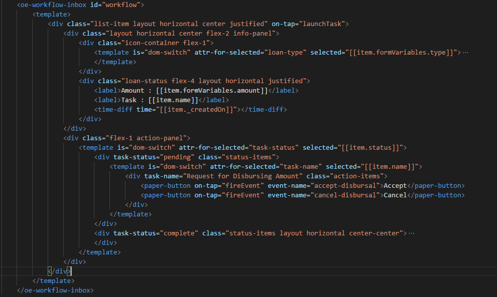

# Oe-Workflow-Inbox
oe-workflow-inbox component helps to list all the tasks assigned to a particular user based on the username or roles.

Based on the current session all the tasks are fetched and listed according to the following types :
Total : All the tasks assigned to the user/roles
Role : All the tasks assigned to the roles
Pending : All the pending tasks for that user/role
Completed : All completed tasks for that user/role

## Search
User can search a particular task based on its name.

## Refresh
Fetches the updated list of tasks.

## Task Action
Clicking on a pending task launches a custom action associated with the task.
oe-workflow-modeler can be used to associate a polymer form to the user  task.
User task contains a formKey which takes input of the following type:
* elem:[element-name]

    * When formKey is prefixed with elem: the rest of the formKey is taken as element name and the task information is passed to it.

* import:[import-url]

    * When formKey is prefixed with import: the rest of the formKey is taken as the import path for the element, It is dynamically imported and the task information is passed to it.

* event:[event-name]

    * When formKey is prefixed with elem: the rest of the formKey is taken as the event name , when the task is clicked this event is fired with the task info as the event detail.

The custom elements can use oe-workflow-form-behavior to complete the current task.

## oe-workflow-form-behavior
It contains the following properties :
taskInfo : It contains model data.
_task : It contains the entire task object.

It contains the following method :

completeTask : It accepts a payload, id and a callback function.The payload data should be handled by the form as it varies from task to task.

## Templating

oe-workflow-inbox provides the user to specify their custom template for the tasks listing screen.
These templates should include the following implementations.

* launchTask : The templates should implement an `on-tap="launchTask"` call on the element to specify to perform task action.

* fireEvent (Optional): The template items may call `on-tap="fireEvent"` to get the task info via a event name without starting the usual task action. 
In such cases the element that calls the fireEvent function should contain an  `event-name` attribute to specify the event-name on which the task information will be sent.

In the above example clicking on the accept button , fires `accept-disbursal` event with the task information.
